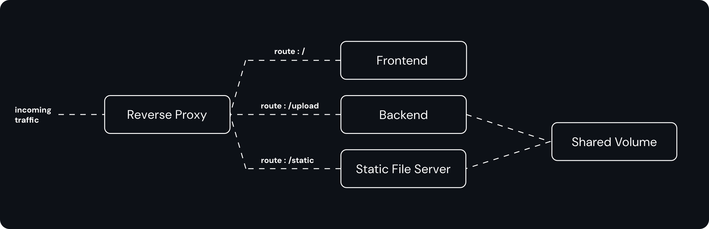

# RapidFort Assignment

### Software Design



### Bonus Features

1. Hosted API Endpoint. [Read More](./endpoint.md).
2. Microservies Architecture 

### Get Started

- Run Bash Script
  ```
  wget https://raw.githubusercontent.com/thekarananand/rf-assignment/main/deploy/runContainers.sh
  sh ./runContainers.sh
  ```

  [view runContainer.sh](./deploy/runContainers.sh)

  ---

- Run with Docker Compose
  ```
  wget https://raw.githubusercontent.com/thekarananand/rf-assignment/main/deploy/compose.yaml
  docker compose up
  ```

  [view compose.yaml](/deploy/compose.yaml)

  ---

- Run on Kubernetes
  ```
  wget https://raw.githubusercontent.com/thekarananand/rf-assignment/main/deploy/defination.yaml
  kubectl create -f defination.yaml
  ```

  [view defination.yaml](./deploy/defination.yaml)

  ---

- Local Build & Run with Docker Compose
  ```
  git clone https://github.com/thekarananand/rf-assignment.git
  cd rf-assignment
  docker compose up --build -d
  ```

  [view compose.yaml](./compose.yaml)


